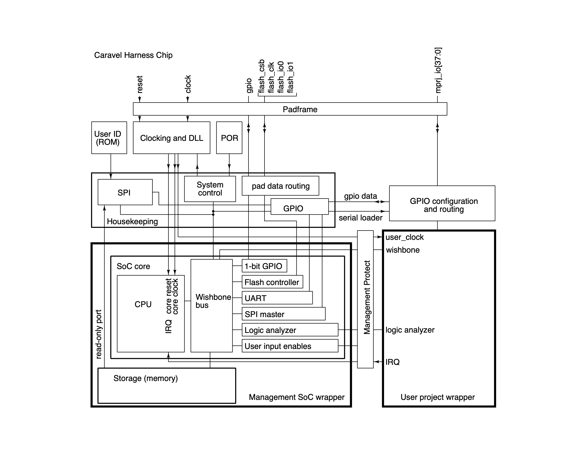

# Open MPW Shuttle Guide

The shuttle provides opportunities for designers to experiment and push the state-of-the-art without having to reconcile the risk associated with the cost of fabrication.

The shuttle program is open to anyone, provided that their project is fully open source and meets the other program requirements. Costs for fabrication, packaging, evaluation boards and shipping are covered by Google for this program.

## Project Submission Requirements
The following project requirements must be met in order to qualify for inclusion on the shuttle program:

- The project must be targeted on the currently-supported SkyWater Open PDK for the 130nm process.
- The project must be posted on a git-compatible repo and be publicly accessible.
- The top-level of the project must include a LICENSE file for an approved open-source license agreement. Third-party source code must be identified and source code must contain proper headers. See details here.
- The repo must include project documentation and adhere to Google's inclusive language guidelines. See details here.
- The project must be fully open. The project must contain a GDSII layout, which must be reproducible from source contained in the project.
- Projects must use a common test harness and padframe based on the Caravel repo. New projects should start by duplicating or forking the Caravel User Project repo and implementing their project using the user_project_wrapper. The Caravel repo is configured as a submodule in the project under the ‘caravel’ directory. Note -- you do not need to initialize nor clone the Caravel sub-directory to complete or submit your project. See the project README for further instructions. The projects must be implemented within the user space of the layout and meet all requirements for the Caravel.
- Projects must successfully pass the Open MPW precheck tool, including LVS and DRC clean using the referenced versions of OpenLane flow. Projects should implement and pass a simulation testbench for their design integrated into Caravel. The Caravel User Project provides an example of how to implement this.

## SkyWater SKY130 PDK

SKY130 is a mature 180nm-130nm hybrid technology developed by Cypress Semiconductor that has been used for many production parts. SKY130 is now available as a foundry technology through SkyWater Technology Foundry.

The technology is the 8th generation SONOS technology node (130nm).

The technology stack consists of:
- 5 levels of metal (p - penta)
- Inductor or Inductor-Capable (i)
- Poly resistor (r)
- SONOS shrunken cell (s)
- Supports 10V regulated supply (10R)

The process stack diagram is as follows.


## Installing Ngspice

### Linux (Ubuntu)
Use the following command
```
sudo apt install ngspice
```

For other linux distros, follwo the instructions [here](http://ngspice.sourceforge.net/ngspice-tutorial.html).


### Mac
Use the following command
```
brew install ngspice
```

### Windows

Detailed install instructions for windows users can be found [here](http://ngspice.sourceforge.net/ngspice-tutorial.html#downloadw)


## Installing Magic VLSI

To install the Magic VLSI layout tool, run the following commands

```
git clone https://github.com/RTimothyEdwards/magic
cd magic
./configure
make
sudo make install
```

## Installing SkyWater SKY130 PDK

To install the SkyWater SKY130 PDK, run the following commands

```
git clone https://github.com/RTimothyEdwards/open_pdks
cd open_pdks
./configure --enable-sky130-pdk
make
sudo make install
```

There is a chance you may get some errors during this process. Pay close attention to the error messages and fix them accordingly. Please understand that the PDK is still in an experimental preview phase and hence the install scripts are not production ready and require manual intervention that varies from user to user.


## Projects


## Caravel

Caravel is a template SoC for Efabless Open MPW and chipIgnite shuttles based on the Sky130 node from SkyWater Technologies. The current SoC architecture is given below.



Caravel is composed of the harness frame plus two wrappers for drop-in modules for the management area and user project area.

### Harness Definition

The harness itself contains the clocking module, DLL, user ID, housekeeping SPI, POR, and GPIO control.

GPIO handling moved out of management SoC and into SPI. SPI gets a wishbone interface; the management SoC talks to the SPI through wishbone, not by taking over the 4-pin SPI interface.

A new block like the ID has the mode at power-up for each GPIO. Can be configured with a text file. SPI pins are fixed for operation on startup.

On power-up, the SPI automatically configures the GPIO. Manual load is possible from both the SPI and from the wishbone bus.

All functions within the harness but outside the management SoC are incorporated into one large module called "housekeeping". This includes a number of registers for all the included functions, with a "front door" SPI interface connected to the padframe through GPIO pins 1 to 4, and a "back door" wishbone interface connected to the management SoC. The management Soc reserves the memory block at 0x26000000 for the housekeeping module. The housekeeping module exchanges data with the management SoC via an interface that uses the byte- wide SPI register data. A small state machine reads four contiguous wishbone addresses and an address decoder determines the corresponding SPI register. The state machine stalls the SoC until all four bytes have been handled before returning the acknowledge signal.

### Management Area

The management area is a drop-in module implemented as a separate repo. It typically includes a RISC-V based SoC that includes a number of peripherals like timers, uart, and gpio. The management area runs firmware that can be used to:

- Configure User Project I/O pads
- Observe and control User Project signals (through on-chip logic analyzer probes)
- Control the User Project power supply

The management area implements SRAM for the management SoC.

The default instantiation for the management core can be found here . See documentation of the management core for further details.

### User Project Area

This is the user space. It has a limited silicon area 2.92mm x 3.52mm as well as a fixed number of I/O pads 38 and power pads 4.

The user space has access to the following utilities provided by the management SoC:

- 38 IO Ports
- 128 Logic analyzer probes
- Wishbone port connection to the management SoC wishbone bus.

## User Projects

Your area is the full user space, so feel free to add your project there or create a different macro and harden it separately then insert it into the user_project_wrapper for digital projects or insert it into user_project_analog_wrapper for analog projects.

### Digital User Project

If you are building a digital project for the user space, check a sample project at caravel_user_project.

If you will use OpenLANE to harden your design, go through the instructions in this README.

Digital user projects should adhere the following requirements:

- Top module is named user_project_wrapper
- The user_project_wrapper adheres to the pin order defined at Digital Wrapper Pin Order.
- The user_project_wrapper adheres to the fixed design configurations at Digital Wrapper Fixed Configuration.
- The user project repository adheres to the Required Directory Structure.

### Analog User Project

If you are building an analog project for the user space, check a sample project at caravel_user_project_analog.

Analog user projects should adhere the following requirements:

- Top module is named user_analog_project_wrapper
- The user_analog_project_wrapper uses the empty analog wrapper.
- The user_analog_project_wrapper adheres to the same pin order and placement of the empty analog wrapper.

## Further documentation will be added soon.

## References
1. [Open MPW Shuttle Program Official Website](https://efabless.com/open_shuttle_program/5)
1. [Caravel User Project Documentation](https://caravel-user-project.readthedocs.io/en/latest/)
1. [Caravel Official Repo](https://github.com/efabless/caravel)
